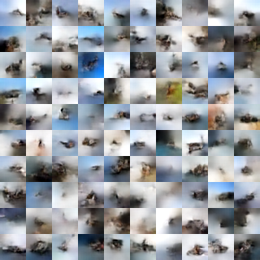

# Revisiting normalizing flows


<br>
**Fig 1:** Samples from an unconditional model with affine coupling layers trained on the CIFAR-10 dataset with temperature 1.0 after 10 epochs (**left**) and 600 epochs (**right**) using [Horovod](https://github.com/horovod/horovod) (You can find our Dockerfile [here](https://github.com/PfizerRD/dl-gpu-utils/blob/master/dockerfiles/horovod_py3gpu/Dockerfile)).

<br>
If you recall from our [previous discussion](glow.md) on **Glow** ([Kingma and Dhariwal 2018]((https://arxiv.org/abs/1807.03039))), an attractive aspect of normalizing flows is that the exact log-likelihood of input data <script type="math/tex">\log p(\mathbf{x})</script> becomes tractable. As a result, the training criterion of a flow-based generative model is simply the negative log-likelihood (bits per dimension) over the training dataset <script type="math/tex">\mathcal{D}</script>:

<script type="math/tex; mode=display">\mathcal{L}(\mathcal{D})
= - \frac{1}{\vert\mathcal{D}\vert}\sum_{\mathbf{x} \in \mathcal{D}} \log
p(\mathbf{x})</script>

What distinguishes flow-based generative models' capacity for exact inference
versus other types of generative models? Simply, it's that flow-based models
combine several fundamental concepts as a substrate for transforming
distributions in a way that optimization of the log-likelihood is tractable.
I'll review the motivation and implementation of a normalizing flow through
the use of **bijective functions**.


## Bijective functions

In deep learning, rich high-dimensional densities typically use invertible
volume-preserving mappings or mappings with fast volume adjustments -- i.e.
the logarithm of the determinant of the Jacobian has linear complexity with respect
to dimensionality. For a given probability distribution <script
type="math/tex">p_{Y}(\mathbf{y})</script>, the density is:

$$p_{Y}(\mathbf{y}) = p_{X}(G^{-1}(\mathbf{y}))\ \mathrm{det}
( \frac{\partial}{\partial\mathbf{y}} G^{-1}(\mathbf{y} ))$$

where <script type="math/tex">G^{-1}</script> is an inverse transformation and <script
type="math/tex">\mathrm{det}(\frac{\partial}{\partial\mathbf{y}}
G^{-1}(\mathbf{y}))</script> is the determinant of the Jacobian.

We can then compute the log determinant of the Jacobian of the inverse
transformation; we can also easily verify the "volume-preserving" property of
the transformation:

<script type="math/tex; mode=display">
\begin{align}
  \mathrm{det} \left ( \frac{\partial}{\partial\mathbf{y}} G^{-1}(\mathbf{y}) \right )
  & = \mathrm{det}
  \begin{pmatrix}
    \frac{\partial}{\partial y_1} y_1             & \frac{\partial}{\partial y_2} y_1 \newline
    \frac{\partial}{\partial y_1} y_2 + y_1^2 + 1 & \frac{\partial}{\partial y_2} y_2 + y_1^2 + 1 \newline
  \end{pmatrix} \newline
  & = \mathrm{det}
  \begin{pmatrix}
    1     & 0 \newline
    2 y_1 & 1 \newline
  \end{pmatrix}
  = 1
  \end{align}
</script>

Fortunately for us, libraries like [TensorFlow
Probablility](https://www.tensorflow.org/probability) have already done some of
the heavy lifting by providing an extensive selection of different probability
distribution and bijector classes. Both the `Distribution` and `Bijector`
classes are used to comprise a `TransformedDistribution`, which models `p(y)`
given a base distribution (an instance of the `Distribution` class)
and an invertible, differentiable transform `Y = g(X)` (an instance of
the `Bijector` class), where `g` is a deterministic
[diffeomorphism](https://en.wikipedia.org/wiki/Diffeomorphism). The [TFP
API](https://www.tensorflow.org/probability/api_docs/python/tfp/bijectors/Bijector#class_bijector) declares three operations that characterize a ``Bijector``:

> Forward

> Useful for turning one random outcome into another random outcome from a different distribution.

> Inverse

> Useful for "reversing" a transformation to compute one probability in terms of another.

> `log_det_jacobian(x)`

> "The log of the absolute value of the determinant of the matrix of all first-order partial derivatives of the inverse function."

Thus, creating our bijector by subclassing `Bijector``:

```python
import tensorflow_probability as tfp


# forward transformation as instance method
class Foo(tfp.bijectors.Bijector):

  def __init__(self, name="Foo"):

  super(Foo, self).__init__(inverse_min_event_ndims=1,
                            name=name)


  def _forward(self, x):

  y_0 = x[..., 0:1]
  y_1 = x[..., 1:2] - y_0**2 - 1
  y_tail = x[..., 2:-1]

  return tf.concat([y_0, y_1, y_tail], axis=-1)
```


Next, let's look at a simple example illustrating standard `TransformedDistribution` ops by constructing a Log-Normal distribution from a Normal distribution:

```python
ds = tf.contrib.distributions
log_normal = ds.TransformedDistribution(
  distribution = ds.Normal(loc=0., scale=1.),
  bijector = ds.bijectors.Exp(),
  name="LogNormalTransformedDistribution")
```

We've instantiated a `TranformedDistribution` with an `Exp` bijector and
`Normal` distribution with parameters `loc = 0` and `scale = 1`
(<script type="math/tex">\mu</script> and <script type="math/tex">\Sigma</script>,
respectively). It's worth noting that in TFP, we can start to initialize batches
of scalar-valued Normals (and other distributions) by broadcasting.

## Affine coupling layers

As I mentioned, in the **RealNVP** (Real-valued Non-Volume Preserving; [Dinh et al. 2017](https://arxiv.org/abs/1605.08803)) paper normalizing flows are implemented by stacking a sequence of invertible bijective transformation functions. In each bijection <script type="math/tex">f: \mathbf{x} \mapsto \mathbf{y}</script>, known as the <em>affine coupling layer</em> (ACL), the input dimensions are split into two parts:</p>
<ul>
  <li>The first <script type="math/tex">d</script> dimensions remain the same.</li>
  <li>The second part, <script type="math/tex">d+1</script> to <script type="math/tex">D</script> dimensions, undergo an affine transformation (“scale-and-shift”) and both the scale and shift parameters are functions of the first <script type="math/tex">d</script> dimensions.</li>
</ul>

<script type="math/tex; mode=display">% <![CDATA[
\begin{aligned}
\mathbf{y}_{1:d} &= \mathbf{x}_{1:d} \\ 
\mathbf{y}_{d+1:D} &= \mathbf{x}_{d+1:D} \odot \exp({s(\mathbf{x}_{1:d})}) + t(\mathbf{x}_{1:d})
\end{aligned} %]]></script>

where <script type="math/tex">s(.)</script> and <script type="math/tex">t(.)</script> are <em>scale</em> and <em>translation</em> functions and both map <script type="math/tex">\mathbb{R}^d \mapsto \mathbb{R}^{D-d}</script>. How would we go about coding this?

Let's decompose this in pseudo-code. The first component of the input dimension is straightforward since it's simply:

```python
y[0,d] = x[0:d]
```

However, the second component requires that we scale-and-shift the last `D-d` units contingent on the first `d` units only, while the first `d` units are masked and left unchanged. In TensorFlow, this would look like:

```python
y[d:D] = x[d:D] * tf.exp(log_scale_fn(x[0:d])) + shift_fn(x[0:d])
```
<br>
</br>


