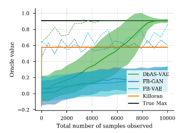

# On conditioning by adaptive sampling (Part I)

A [recent paper](https://arxiv.org/abs/1901.10060) by David Brookes, Hahnbeom Park, and Jennifer Listgarten[^1] extends their [work from last year](https://arxiv.org/abs/1810.03714) that posits a framework, **Conditioning by Adaptive Sampling (CbAS)**, for model-based conditional density estimation. Of particular relevance to us here at Pfizer is the application to protein design. For example, how do we go about optimizing the design of DNA sequences for protein expression, binding, or for protein sequences that maximize properties like secondary structure or fluorescence?  Traditionally, *in vitro* methods for protein engineering have been exhaustive usually involving greedy walks through protein design space like [directed evolution (DE)](https://www.ncbi.nlm.nih.gov/pubmed/1367624). This paper proposes a more efficient *in silico* approach. For this particular entry, I'll summarize the key contributions and introduce some of the core concepts. The subsequent post will walk through the **Cross-Entropy Method (CEM)** and their experimental results.

## Summary

The main contributions of this paper are as follows:

- The authors present a method for tackling design problems in discrete space including the problem of maximizing protein fluorescence using [avGFP sequence data](https://figshare.com/articles/Local_fitness_landscape_of_the_green_fluorescent_protein/3102154) from [Sarkisyan et al. 2016](https://www.nature.com/articles/nature17995).
- A principled approach for conditional density estimation in the presence of rare events and which doesn't constrain the oracle by requiring differentiability.
    - This has the added benefit of recapitulating models in various scientific domains which may not be readily differentiable to begin with
    - It also allows for a degree of flexibility of validation by using wet-lab experiments as the oracle.
- An exact and iterative importance sampling-based estimation method for variance reduction and computationally intractable model densities.
- Generalizability of CbAS to specification of property values rather than solely maximization (e.g. a protein fluorescing at a desired wavelength as opposed to being maximally fluorescent).

## Oracles and oracle properties

In order to understand the problem setting in the paper, it's worth briefly reviewing oracles. In statistic learning, oracle and oracle properties have been extensively used in the context of high-dimensional model estimation and feature selection whereby we have a response vector  and input vector of linearly independent features   with . Under the assumption that we have , the true model only depends on a subset  of its feature space.

Briefly put, an **oracle property** is a theoretical attribute ascribed to a model if it performs as well as if the correct underlying model were given in advance. More formally and following [Fan and Li 2001](https://orfe.princeton.edu/~jqfan/papers/01/penlike.pdf), [Fan and Peng 2004](https://projecteuclid.org/euclid.aos/1085408491), and [Zou 2006](http://pages.cs.wisc.edu/~shao/stat992/zou2006.pdf), we call a given fitting procedure  an **oracle** if , the coefficient estimator, identifies the right subset model,  with some optimal estimation rate:

Thus, the oracle property holds that the asymptotic distribution of the estimator is the same as the asymptotic distribution of the MLE only on the true support. That is, the estimator adapts to knowing the true support without incurring a price. Why is this important? For the authors, they argue that their oracle  effectively serves as a proxy for expensive and exhaustive laboratory-based property measurements. They also make the assumption that given an input, such as a DNA sequence, the oracle[^2] returns a distribution over the properties of interest. It's worth noting that this is within the context of the generative setting where we model the joint probability distribution . Given the property oracle then, one can subsequently model and empirically sample from the underlying data distribution  with a generative model  whose prior is conditioned on the desiderata encoded in property values . The claim here is that this gives a certain degree of flexibility in specifying priors on the design space, unlike [Gómez-Bombarelli et al. 2018](https://pubs.acs.org/doi/full/10.1021/acscentsci.7b00572) and [Killoran et al. 2017](https://arxiv.org/abs/1712.06148), which utilize a fixed VAE and GAN respectively.

Lastly, it's worth noting that they do not require their oracle to be differentiable and this additionally circumvents backpropagation through discrete input space.

## Conditioning by adaptive sampling

The problem setting is as follows: find settings of the discrete random vector  (e.g. representative of DNA sequences) that have a high probability of satisfying some property desiderata (e.g. maximal fluoresence of a protein).

The inference problem is expressed as:

$$p(\boldsymbol{x}|S, \theta^{(0)}) = \frac{P(S|\boldsymbol{x})p(\boldsymbol{x}|\theta^{(0)})}{P(S|\theta^{(0)})}$$

where . 

Like [variational inference](https://arxiv.org/abs/1601.00670), the marginal probability of CbAS yields no analytic solution as the sum over all possible configurations of the latent structures and its parameters is intractable. Unsurprisingly, inference for CbAS is VI-like in that they minimize the KL divergence between the conditional and the approximating search model, :

$$\phi^{*} = \underset{\phi}{\operatorname{argmin}} D_{KL} \big(p(\boldsymbol{x}|S,\theta^{(0)})||q(\boldsymbol{x}|\phi\big)$$

This can be re-written in terms of the log expectation of the difference between the search model distribution and the target conditional distribution, similar to how the **Evidence Lower Bound (ELBO)** can be derived:

$$\underset{\phi}{\operatorname{argmin}}\mathbb{E}_{p(\boldsymbol{x}|S,\theta^{(0)})}[\log p(\boldsymbol{x}|S,\theta^{(0)}) - \log q(\boldsymbol{x}|\phi)]$$

Thus, the second expectation can be expressed as the entropy of the target conditional distribution :

The authors also note that the difficulty of estimating the normalizing constant is compounded by the fact that  (and by definition,  ) is "exceedingly rare". This translates to difficulties in optimization: any gradient-based reparameterization which yields differentiable Monte Carlo (MC) estimates of our expectation (i.e. the 'reparameterization trick' from [Kingma and Welling 2014](https://www.ics.uci.edu/~welling/publications/papers/AEVB_ICLR14.pdf)) would require a non-trivial number of samples to be accurate and be very challenging for distributions over discrete state spaces. To put it another way, any naive MC estimation would require an intensive simulation effort, inversely proportional to the magnitude of .

## Importance sampling-based estimation

I'm not going to exhaustively review importance sampling here[^3]. Suffice to say that the basic idea is that we can estimate the expectation of a random variable under one distribution  from samples of a different distribution  and that our importance sampling distribution  can be used to mitigate the problem of high variance and an exceedingly small expectation . This approach is not without drawbacks however, and perturbations in weight space can have deleterious effects on the estimator.

Thus, the objective can be rewritten as:

where  is our target density,  is our proposed density and the ratio of the two:

$$\frac{p(\boldsymbol{x}|\theta^{(0)})}{q(\boldsymbol{x}|\phi^{(t)})}$$

is the eponymous **importance weight**. Now that we have this objective and given samples  from , we can construct MC estimates:

I think this is a particularly clever reformulation because it does not constrain the authors' choice of search model distribution to a single model class. For example, for cases where marginalization over latent space is intractable and the CbAS objective cannot be solved exactly (i.e. where a vanilla VAE is used), approximate inference approaches can be used instead to extend the model class, something I alluded to earlier. I'm not going to go through the [explicit derivation of the ELBO-like objective](https://arxiv.org/pdf/1901.10060.pdf) but it's worth noting that in many cases where the CbAS update can be solved, this product: 

translates to an importance weighting of the probability of a series of property value sets  conditioned on each data point,  (i.e. the weight of each data point). This is similar to a weighted maximum likelihood objective and can therefore be optimized using any number of standard approaches for training generative models.

More to come on the experimental results in the next entry...

<!-- Bears similarity with the **Cross-Entropy Method (CEM)** of [Rubinstein 1999](https://link.springer.com/article/10.1023/A:1010091220143).

 -->

[^1]: A good entry point to Listgarten's earlier work is her interview on [Talking Machines](https://art19.com/shows/talking-machines/episodes/632ffc91-f94b-4997-9b62-8d2c03840c21), where she discusses her work at MSR New England on predicting off-target effects for CRISPR guide design.

[^2]: Additional assumptions are that the oracle is well-behaved and noise-free

[^3]: For this, I recommend [this chapter](https://statweb.stanford.edu/~owen/mc/Ch-var-is.pdf) from Art Owen's book, "Monte Carlo theory, methods and examples".