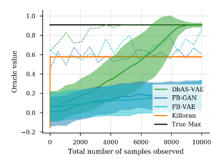

## Importance sampling-based estimation

I'm not going to review importance sampling here[^2], suffice to say that an importance sampling distribution  can be used to mitigate the problem of high variance and an exceedingly small expectation . Thus, the objective can be rewritten as:

$$\mathbb{E}_{r(\boldsymbol{x})}\Bigg[\frac{p(\boldsymbol{x}|\theta^{(0)})}{r(x)}[P(S|\boldsymbol{x}) \log q(\boldsymbol{x}|\phi)]\Bigg]$$

Bears similarity with the **Cross-Entropy Method (CEM)** of [Rubinstein 1999](https://link.springer.com/article/10.1023/A:1010091220143). The main idea with CEM is to transform a given optimization problem to an associated stochastic problem (ASP)

