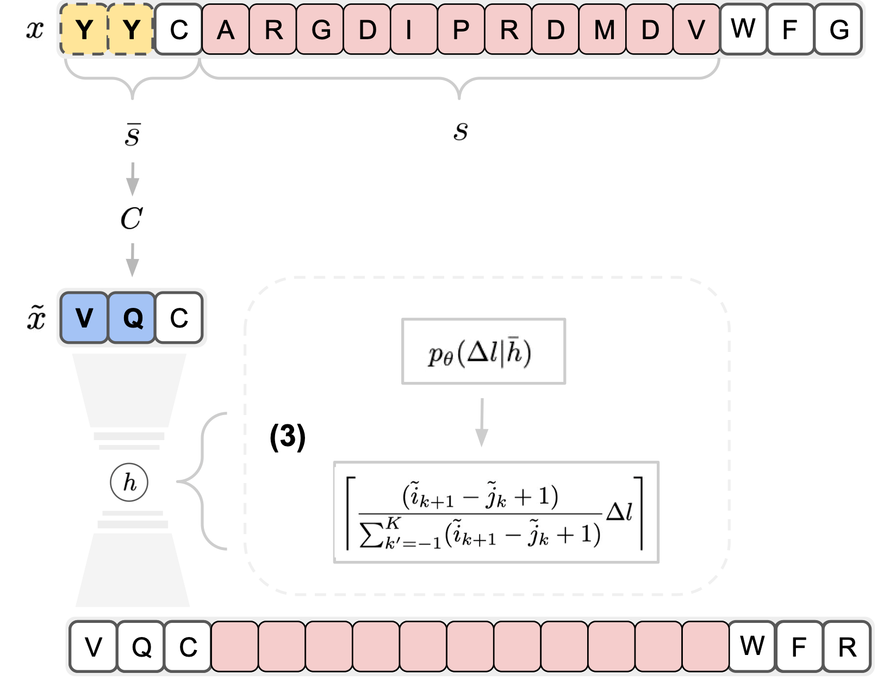
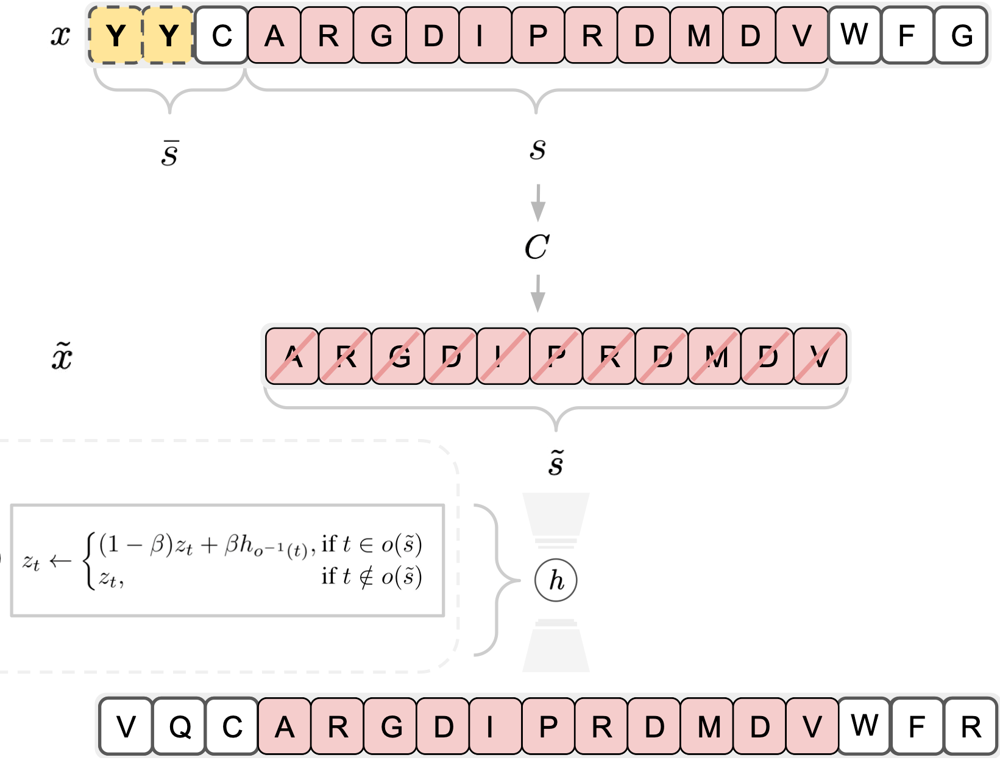
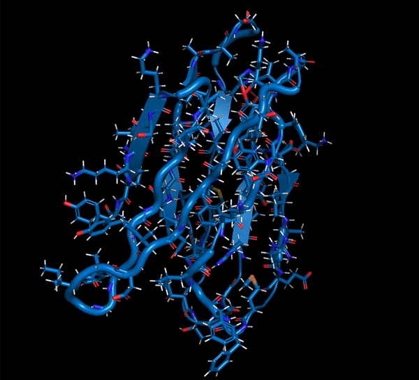
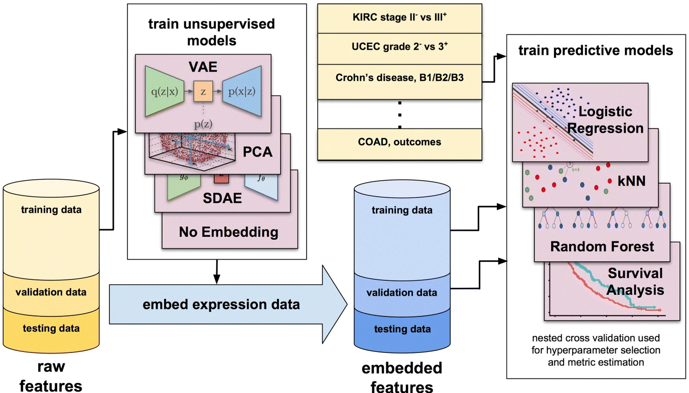
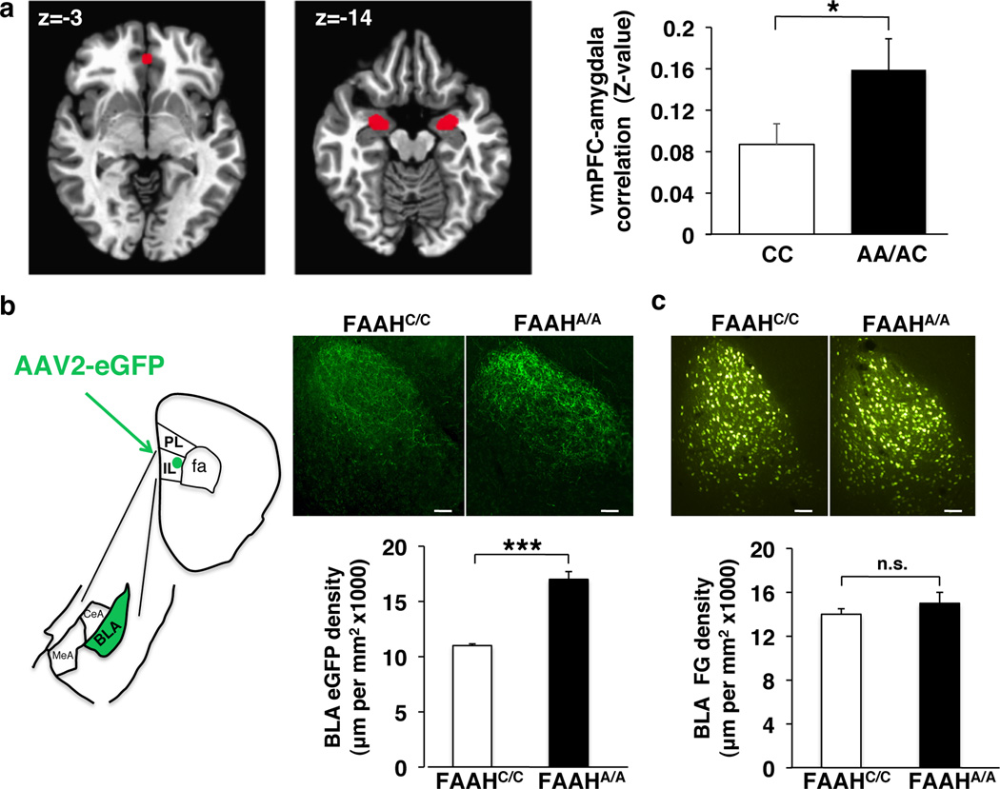
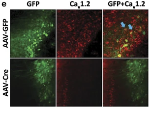

---
hide:
  - footer
---

I am the Director of Frontier Research at <a href="https://www.gene.com/prescient">Prescient Design</a>, a Genentech Accelerator, where I work. 

Previously, I was Head of Machine Learning at Pfizer R&D from 2017 to 2021, where I led a research group focused on <a href="https://insights.pfizer.com/pfizer-is-using-ai-to-discover-breakthrough-medicines">developing methods for various problems in drug discovery and design</a> including better adaptation and controllable generation in generative models and active learning.

My background is in statistical machine learning and neuroscience, having worked on my Ph.D. in Computer Science and Statistics. I finished my graduate studies at Columbia University and undergraduate studies at Cornell University.

<heading>Research (Select Publications)</heading>
            </td>
          </tr>
        </tbody></table>
        <table style="width:100%;border:0px;border-spacing:0px;border-collapse:separate;margin-right:auto;margin-left:auto;"><tbody>
          <tr onmouseout="msps_stop()" onmouseover="msps_start()">
            <td style="padding:20px;width:25%;vertical-align:middle">
              

                

                  

                
              

              
  </td>
  <td style="padding:20px;width:75%;vertical-align:middle">
    <a href="img/multi_segment_preserving_sampling.pdf">
      <papertitle>Multi-segment preserving sampling for deep manifold sampler</papertitle>
    </a>
     
    <a href="https://www.gene.com/scientists/our-scientists/daniel-berenberg">Daniel Berenberg</a>,
    <a href="https://www.gene.com/scientists/our-scientists/jae-hyeon-lee">Jae Hyeon Lee</a>, 
    <a href="https://www.gene.com/scientists/our-scientists/simon-kelow">Simon Kelow</a>,  
    <a href="https://jiwoncpark.github.io/">Ji Won Park</a>,
    <a href="https://www.andrewmwatkins.com/">Andrew Watkins</a>,
    <a href="https://www.gene.com/scientists/our-scientists/vladimir-gligorijevic">Vladimir Gligorijević</a>,  
    <a href="https://as.nyu.edu/faculty/richard-bonneau.html">Richard Bonneau</a>,
    <strong>Stephen Ra</strong>,
    <a href="https://kyunghyuncho.me/">Kyunghyun Cho</a>
     
    <em>ICLR Machine Learning for Drug Discovery Workshop</em>, 2022 <strong>(Oral Presentation)</strong> 
     
    <a href="https://arxiv.org/abs/2205.04259">paper</a>
    /
    <a href="img/multi_segment_preserving_sampling.pdf">poster</a>
    

  </td>
</tr>

<tr onmouseout="manifoldstop()" onmouseover="manifoldstart()">
  <td style="padding:20px;width:25%;vertical-align:middle">
    

      
<video  width=100% height=100% muted autoplay loop>
      <source src="img/manifold_sampling.mp4" type="video/mp4">
      Your browser does not support the video tag.
      </video>

      
    

    
  </td>
  <td style="padding:20px;width:75%;vertical-align:middle">
    <a href="img/deep_manifold_sampling.pdf">
      <papertitle>Function-guided protein design by deep manifold sampling</papertitle>
    </a>
     
    <a href="https://www.gene.com/scientists/our-scientists/vladimir-gligorijevic">Vladimir Gligorijević</a>,
    <a href="https://www.gene.com/scientists/our-scientists/daniel-berenberg">Daniel Berenberg</a>,
    <strong>Stephen Ra</strong>,  
    <a href="https://www.andrewmwatkins.com/">Andrew Watkins</a>,
    <a href="https://www.gene.com/scientists/our-scientists/simon-kelow">Simon Kelow</a>,
    <a href="https://kyunghyuncho.me/">Kyunghyun Cho</a>,  
    <a href="https://as.nyu.edu/faculty/richard-bonneau.html">Richard Bonneau</a>
     
    <em>NeurIPS Machine Learning for Structural Biology Workshop</em>, 2021 <strong>(Oral Presentation)</strong>  
     
    <a href="https://www.biorxiv.org/content/10.1101/2021.12.22.473759v1">paper</a> / 
    <a href="img/deep_manifold_sampling.pdf">poster</a>
    

  </td>
</tr>

<tr onmouseout="bbrt_stop()" onmouseover="bbrt_start()">
  <td style="padding:20px;width:25%;vertical-align:middle">
    

      
<video  width=100% height=100% muted autoplay loop>
      <source src="img/bbrt.gif" type="video/mp4">
      Your browser does not support the video tag.
      </video>

      
    

    
  </td>
        <td style="padding:20px;width:75%;vertical-align:middle">
      <a href="img/bbrt.pdf">
        <papertitle>Black box recursive translations for molecular optimization</papertitle>
      </a>
       
      <a href="http://fdamani.com/">Farhan Damani</a>,
      <a href="https://dbgroup.mit.edu/vishnu-sresht-0">Vishnu Sresht</a>,
      <strong>Stephen Ra</strong>
       
<em>NeurIPS Machine Learning for Molecules Workshop</em>, 2020
       
      <a href="https://arxiv.org/abs/1912.10156">paper</a>
/
      <a href="img/bbrt.pdf">poster</a>
      

    </td>
  </tr>
  
<tr onmouseout="phenotype_stop()" onmouseover="phenotype_start()">
  <td style="padding:20px;width:25%;vertical-align:middle">
    

      
    

    
  </td>
  <td style="padding:20px;width:75%;vertical-align:middle">
    <a href="https://slideslive.com/38921963/learning-meaningful-representations-of-life-4">
      <papertitle>Deep learning of representations for transcriptomics-based phenotype prediction
      </papertitle>
    </a>
     
    <a href="https://www.unlearn.ai/employees/aaron-smith">Aaron Smith</a>,
    <a href="https://www.unlearn.ai/employees/jon-walsh">Jonathan Walsh</a>,
    John Long,
    Craig Davis,  
    <a href="https://scholar.google.com/citations?user=yzdOz0AAAAAJ&hl=en">Peter Henstock</a>,
    Martin Hodge,
    <a href="https://www.mattmaciejewski.com/">Mateusz Maciejewski</a>,  
    <a href="https://scholar.google.com/citations?user=nbEu1ecAAAAJ&hl=en">Xinmeng Jasmine Mu</a>,
    <strong>Stephen Ra</strong>,
    <a href="https://scholar.google.com/citations?user=nYxINNEAAAAJ&hl=en">Shanrong Zhao</a>,  
    <a href="https://0-scholar-google-com.brum.beds.ac.uk/citations?user=FyB0OtAAAAAJ&hl=sv">Daniel Ziemek</a>,
    <a href="https://www.unlearn.ai/employees/charles-k-fisher">Charles Fisher</a>
     
    <em>BMC Bioinformatics</em>, 2020 & <em>NeurIPS Learning Meaningful Representations of Life Workshop</em>, 2019 <strong>(Oral Presentation)</strong>
     
    <a href="https://bmcbioinformatics.biomedcentral.com/articles/10.1186/s12859-020-3427-8">paper</a>
    /
    <a href="https://www.biorxiv.org/content/10.1101/574723v2">poster</a>
    /
    <a href="https://github.com/unlearnai/representation_learning_for_transcriptomics">code</a>
    /
    <a href="https://figshare.com/projects/Deep_learning_of_representations_for_transcriptomics-based_phenotype_prediction/60938">data</a>
    /
    <a href="https://slideslive.com/38921963/learning-meaningful-representations-of-life-4">video</a>
    

  </td>
</tr> 

<tr onmouseout="bbrt_stop()" onmouseover="bbrt_start()">
  <td style="padding:20px;width:25%;vertical-align:middle">
    

      
    

    
  </td>
        <td style="padding:20px;width:75%;vertical-align:middle">
      <a href="https://www.nature.com/articles/ncomms7395">
        <papertitle>FAAH genetic variation enhances frontoamygdala function in mouse and human</papertitle>
      </a>
       
      Iva Dincheva,
      Andrew Drydsale,
      Catherine Hartley,  
      David Johnson,
      Deqiang Jing,
      Elizabeth King,  
      <strong>Stephen Ra</strong>,
      Megan Gray,
      Ruirong Yang,  
      Ann Marie DeGruccio,
      Chienchun Huang,
      Benjamin Cravatt,  
      Charles Glatt,
      Matthew Hill,
      B.J. Casey,  
      <a href-"https://leelab.weill.cornell.edu/">Francis Lee</a>
       
      <em>Nature Communications</em>, 2015
       
      <a href="https://www.nature.com/articles/ncomms7395">paper</a>
/
      <a href="https://www.nytimes.com/2015/03/08/opinion/sunday/the-feel-good-gene.html?_r=1">nytimes op-ed</a>
      

    </td>
  </tr>

  <tr onmouseout="cacna1c_stop()" onmouseover="cacna1c_start()">
    <td style="padding:20px;width:25%;vertical-align:middle">
      

        
      

      
    </td>
          <td style="padding:20px;width:75%;vertical-align:middle">
        <a href="https://www.nature.com/articles/mp201271">
          <papertitle>Forebrain elimination of cacna1c mediates anxiety-like behavior in mice</papertitle>
        </a>
         
        Anni Lee*,
        <strong>Stephen Ra*</strong>,
        Aditi Rajadhyaksha,  
        Jeremiah Britt,
        Héctor De Jesús-Cortés,
        KL Gonzales,  
        Amy Lee,
        Sven Moosmang,
        Franz Hofmann,  
        <a href="https://www.harringtondiscovery.org/about/harrington-investigators/andrew-pieper-lab">Andrew Pieper</a>,
        <a href="https://vivo.weill.cornell.edu/display/cwid-amr2011">Anjali Rajadhyaksha</a>
         
        <em>Nature Molecular Psychiatry</em>, 2012
         
        <a href="https://www.nature.com/articles/mp201271">paper</a>
        

      </td>
    </tr>
</tbody>
</body>

</html>
