# Black Box Recursive Translations for Molecular Optimization

In this entry, I wanted to highlight work done by ML research intern, [Farhan Damani](http://fdamani.com/) (previously a Ph.D. student with Ryan Adams), a Pfizer colleague [Vishnu Sresht](https://dbgroup.mit.edu/vishnu-sresht-0), and myself, where we cast molecular optimization as a neural translation problem. Our preprint is available on [arXiv](https://arxiv.org/pdf/1912.10156.pdf) and was [accepted at the 2020 NeurIPS Workshop on Machine Learning for Molecules](https://ml4molecules.github.io/papers2020/accepted.html).

The goal here is to map an input compound to a target compound in property space with the expectation that "translated" molecules have some improved biochemical property _desiderata_. Interestingly, we observe that when generated molecules are iteratively fed back into the translator, molecular compound attributes improve with each step akin to self-distillation dynamics. We demonstrate that this finding is largely invariant to the choice of translation model, making this a "black box" algorithm and accordingly call this method **Black Box Recursive Translation (BBRT)**, a new inference method for molecular property optimization. By operating strictly on the inputs and outputs of any translation model, we demonstrate results competitive with the latest, state-of-the-art benchmarks for molecular property optimization tasks. Furthermore, using our simple drop-in replacement with well-known sequence and graph-based models, we show a significant boost in performance relative to non-recursive baselines. Lastly, BBRT facilitates interpretation, allowing users to map the evolution of newly discovered compounds from known starting points.

----

## Introduction

Automated molecular design using generative models offers the promise of rapidly discovering new compounds with desirable properties. Chemical space is large, discrete, and unstructured, which together, present important challenges to the success of any molecular optimization campaign. Approximately $10^8$ compounds have been synthesized[@kim2015pubchem] while the range of potential drug-like candidates is estimated to between $10^{23}$ and $10^{80}$[@polishchuk2013estimation]. Consequently, new methods for intelligent search are paramount.

A recently introduced paradigm for compound generation treats molecular optimization as a translation task where the goal is to map an input compound to a target compound with favorable properties[@jin2018g2g]. This framework has presented impressive results for constrained molecular property optimization where generated compounds are restricted
to be structurally similar to the source molecule.

We extend this framework to unconstrained molecular optimization by treating inference, vis-à-vis decoding strategies, as a first-class citizen. We observe that generated molecules can be repeatedly fed back into the model to generate even better compounds. This finding is
invariant to the choice of translation model, making this a “black box” algorithm. This invariance is particularly attractive considering the recent emphasis on new molecular representations[@GomezBombarelli2018dh] [@Jin2018vae] [@dai2018syntaxdirected] [@Li2018ww] [@Kusner2017tv] [@Krenn2019tk]. Using our simple drop-in replacement, our method can leverage these recently introduced molecular representations in a translation setting for better optimization.

We introduce **Black Box Recursive Translation (BBRT)**, a new inference method for molecular property optimization:

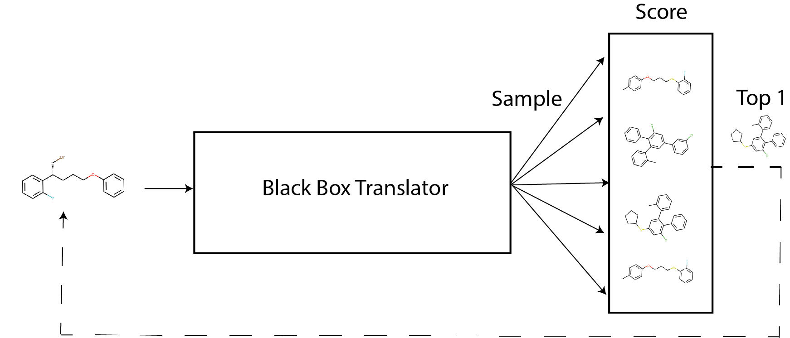

<small><b>Figure 1:</b> Black Box Recursive Translation (BBRT)</small>

**Surprisingly, by applying BBRT to well-known sequence- and graph-based models in the literature, we can produce new state-of-the-art results on property optimization
benchmark tasks.** Through an exhaustive exploration of various decoding strategies, we demonstrate the empirical benefits of using BBRT. We introduce simple ranking methods to decide which outputs are fed back into the model and find ranking to be an appealing approach to secondary property optimization. Finally, we demonstrate how BBRT is an
extensible tool for interpretable and user-centric molecular design applications.

## Related work

**_De novo_ molecular design**. Recent work has focused on learning new molecular representations including graphs[@you2018graphrnn] [@Li2018ww], grammars[@Kusner2017tv] [@dai2018syntaxdirected], trees[@Jin2018vae], and sequences[@GomezBombarelli2018dh] [@Krenn2019tk]. Provided with a molecular representation, latent variable models[@Kusner2017tv] [@dai2018syntaxdirected] [@Jin2018vae], Markov chains [@Seff2019uh], or autoregressive models[@you2018graphrnn] have been developed to learn distributions over molecular data. Molecular optimization has been approached with reinforcement learning[@Popova2018ho] [@Zhou2019cm] and optimization in continuous, learned latent spaces[@GomezBombarelli2018dh]. For sequences more generally, Mueller et al. (2017)[@mueller2017sequence] perform constrained optimization in a latent space to improve the sentiment of source sentences.

We build on recent work introducing a third paradigm for design, focusing on molecular optimization as a translation problem [@jin2018g2g], where molecules are optimized by translating from a source graph to a target graph. While retaining high similarity, the target graph improves on the source graph’s biochemical properties. With many ways to modify a molecule, Jin et al. (2019)[@jin2018g2g] use stochastic hidden states coupled with a left-to-right greedy decoder to generate multi-modal outputs. We extend the translation framework from similarity-constrained molecular optimization to the unconstrained setting of finding the *best* scoring molecules according to a given biochemical property. We show that while their translation model is not fundamentally limited to constrained optimization, their inference method restricts the framework’s application to more general problems.

**Matched molecular pair (MMP) analysis**. MMP analysis is a popular cheminformatics framework for analyzing structure-property relationships[@Kramer2014js] [@Turk2017]. MMPs are extracted by mining databases of
measured chemical properties and identifying pairs of chemical structures that share the same core and differ only by a small, well-defined structural difference; for example, where a methyl group is
replaced by an isopropyl group[@Tyrchan2017]. The central hypothesis underlying MMPs is that the chemical properties of a series of closely related structures can be described by piecewise-independent
contributions that various structural adducts make to the properties of the core.

MMP analysis has become a mainstream tool for interpreting the complex landscape of structure-activity relationships via simple, local perturbations that can be learnt and potentially transferred across drug
design projects[@kubinyi88]. This framework serves as the chemistry analogue to an interpretability technique in machine learning called local interpretable model-agnostic explanations (LIME)[@Ribeiro_2016].
Both MMP and LIME learn local surrogate models to explain individual predictions.

We view molecular translation as a learned MMP analysis. While Jin et al. (2019)[@jin2018g2g] use neural networks to learn a single high-dimensional MMP step, we extend this framework to infer a sequence of MMPs, extending the reach of this framework to problems beyond constrained optimization.

**Translation models.** Machine translation models composed of end-to-end neural networks[@Sutskever2014] have enjoyed significant success as a general-purpose modeling tool for many applications including dialogue generation[@Vinyals2015tz] and image captioning[@vinyals2015show]. We focus on a recently introduced
application of translation modeling, one of molecular optimization[@jin2018g2g].

The standard approach to inference – approximately decoding the most likely sequence under the model – involves a left-to-right greedy search, which is known to be highly suboptimal, producing generic
sequences exhibiting low diversity[@Holtzman2019wa]. Recent work propose diverse beam search[@Li2016ue] [@Vijayakumar2018uu] [@Kulikov2018tv], sampling methods geared towards open-ended tasks[@Fan2018ca] [@Holtzman2019wa], and reinforcement learning for post-hoc secondary objective optimization[@Wiseman2018ub] [@Shen2015uc] [@Bahdanau2016te]. Motivated by molecular optimization as a translation task, we develop Black Box Recursive Translation (BBRT). We show BBRT generates samples with better molecular properties than its non-recursive peers for both deterministic and stochastic decoding strategies.

## Molecular optimization as a translation problem

For illustrative purposes, we describe the translation framework and the corresponding inference method for sequences. We emphasize that our inference method is a black box, which means it is invariant to specific architectural and representational choices.

**Background.** Our goal is to optimize the chemical properties of molecules using a sequence-based molecular representation. We are given $(x,y) \in (\mathcal{X}, \mathcal{Y})$ as a sequence pair, where
$x = (x_1, x_2, \dots, x_m)$ is the source sequence with $m$ tokens and $y = (y_1, y_2, \dots, y_n)$ is the target sequence with $n$ tokens, and $\mathcal{X}$ and $\mathcal{Y}$ are the source and target domains
respectively. We focus on problems where the source and target domains are identical. By construction, our training pairs $(x,y)$ have high chemical similarity, which helps the model learn local edits to $x$.
Additionally, $y$ always scores higher than $x$ on the property to be optimized. These properties are specified beforehand when constructing training pairs. A single task will typically optimize a single property such as potency, toxicity, or lipophilic efficiency.

A sequence to sequence (Seq2Seq) model [@Sutskever2014] learns parameters $\theta$ that estimate a conditional probability model $P(y|x; \theta)$, where $\theta$ is estimated by maximizing the log-likelihood:

$$
L(\theta) = \sum_{(x,y) \in (\mathcal{X}, \mathcal{Y})} \log P(y|x,\theta)
$$

The conditional probability is typically factorized according to the Chain Rule:

$$
P(y|x; \theta) = \prod_{t=1}^n P(y_t | y_{<t}, x, \theta)
$$

These models use an encoder-decoder architecture where the input and output are both parameterized by recurrent neural networks (RNNs). The encoder reads the source sequence $x$ and generates a sequence of hidden representations. The decoder estimates the conditional probability of each target token given the source representations and its preceding tokens. The attention mechanism[@Bahdanau2014vz] helps with token
generation by focusing on token-specific source representations.

## Black Box Recursive Translation (BBRT)

### Current inference methods

For translation models, the inference task is to compute $y^* = {\operatorname{argmax}} p(y|x,\theta)$. Because the search space of potential outputs is large, in practice we can only explore a limited number of
sequences. Given a fixed computational budget, likely sequences are typically generated with heuristics. Decoding methods can be classified as deterministic or stochastic. We now describe both classes of decoding
strategies in detail. For this section, we follow the notation described in Welleck et al. (2019)[@Welleck2019vl].

**Deterministic decoding.** Two popular deterministic methods include
greedy search and beam search[@Graves2012vj] [@BoulangerLewandowski2013wj]. Greedy search performs a
single left-to-right pass, selecting the most likely token at each time step: $y_t = {\operatorname{argmax}} p(y_t|y_{<t}, x,\theta)$. While this method is efficient, it leads to suboptimal generation as it does not take into account the future when selecting tokens.

Beam search is a generalization of greedy search and maintains a set of $k$ hypotheses at each time-step where each hypothesis is a partially decoded sequence. While in machine translation beam search variants are
the preferred method, for more open-ended tasks, beam search fails to generate diverse candidates. Recent work has explored diverse beam search[@Li2016ue] [@Vijayakumar2018uu] [@Kulikov2018tv]. These methods
address the reduction of number of duplicate sequences to varying extents, thereby increasing the entropy of generated sequences.

**Stochastic decoding.** A separate class of decoding methods sample from the model at generation time,
$y_t \sim q(y_t | y_{<t}, x, p_{\theta})$. This method has shown to be effective at generating diverse samples and can better explore target design spaces. We consider a top-$k$ sampler[@Fan2018ca], which
restricts sampling to the $k$ most-probable tokens at time-step $t$. This corresponds to restricting sampling to a subset of the vocabulary $U \subset V$. $U$ is the subset of $V$ that maximizes $\sum_{y \in U} p_{\theta}(y_t | y_{y<t}, x)$:

$$
q(y_t | y_{<t}, x, p_{\theta}) =  \begin{cases} 
      \frac{p_{\theta}(y_t | y_{<t}, x)}{Z} & y_t \in U \\
      0 & \text{otherwise}
   \end{cases}
$$

### Recursive inference

We are given $(x,y) \in (X,Y)$ as a sequence pair where by construction
$(x,y)$ has high chemical similarity and $y$ scores higher on a
prespecified property compared to $x$. At test time, we are interested
in recursively inferring new sequences. Let $y_i$ denote a random
sequence for recursive iteration $i$. Let $\{y_i^{(k)}\}_{k=1}^K$ be a
set of $K$ outputs generated from $p_{\theta}(y_i|x)$ when $i=0$. We use
a scoring function $S$ to compute the best of $K$ outputs denoted as
$\hat{y}_i$. For $i>0$, we infer $K$ outputs from
$p_{\theta}(y_i|\hat{y}_{i-1})$. This process is repeated for $n$
iterations.

**Scoring functions.** In principle, all $K$ outputs at iteration $i$
can be independently conditioned on to generate new candidates for
iteration $i+1$. This procedure scales exponentially with respect to
space and time as a function of $n$ iterations. Therefore, we introduce
a suite of simple ranking strategies to score $K$ output sequences to
decide which output becomes the next iteration’s source sequence. We
consider a likelihood based ranking as well as several
chemistry-specific metrics further described in the experiments.
Designing well-informed scoring functions can help calibrate the
distributional statistics of generated sequences, aid in multi-property
optimization, and provide interpretable sequences of iteratively optimal
translations.

**Ensemble outputs.** After $n$ recursive iterations, we ensemble the
generated outputs $\{y_0, y_1, \dots, y_n\}_{k=1}^K$ and score the
sequences on a desired objective. For property optimization, we return
the $\operatorname{argmax}$. In principle, BBRT is not limited to ensembling recursive
outputs from a *single* model. Different modeling choices and molecular
representations have different inductive biases, which influence the
diversity of generated compounds. BBRT can capitalize on these
differences by providing a coherent method to aggregate results.

## Experiments

We apply BBRT to solve unconstrained and multi-property optimization
problems. To highlight the generality of our method, we apply recursive
translation to both sequence and graph-based translation models. **We
show that BBRT generates state-of-the-art results on molecular property
optimization using already published modeling approaches**. Next we
describe how recursive inference lends itself to interpretability
through the generation of molecular traces, allowing practitioners to
map the evolution of discovered compounds from known starting points
through a sequence of local structural changes. At any point in a
molecular trace, users may introduce a "break point" to consider
alternative translations thereby personally evaluating the trade-offs
between conflicting design objectives. Finally, we apply BBRT to the
problem of secondary property optimization by ranking.

**Models.** We apply our inference method to sequence and graph-based
molecular representations. For sequences, we use the recently introduced
SELFIES molecular representation[@Krenn2019tk], a sequence-based
representation for semantically constrained graphs. Empirically, this
method generates a high percentage of valid compounds[@Krenn2019tk].
Using SELFIES, we develop a Seq2Seq model with an encoder-decoder
framework. The encoder and decoder are both parameterized by RNNs with
Long Short-Term Memory (LSTM) cells[@Hochreiter1997]. The encoder is a 2-layer
bidirectional RNN and the decoder is a 1-layer unidirectional forward
RNN. We also use attention[@Bahdanau2014vz] for decoding. The hidden
representations are non-probabilistic and are optimized to minimize a
standard cross-entropy loss with teacher forcing. Decoding is performed
using deterministic and stochastic decoding strategies described in .
For graphs, we use a tree-based molecular representation[@Jin2018vae]
with the exact architecture described in Jin et al. 2019[@jin2018g2g]. Decoding is
performed using a probabilistic extension with latent variables
described in Jin et al. 2019[@jin2018g2g] -- we sample from the prior $k$ times followed by left-to-right greedy decoding.

**Data**. We construct training data by sampling molecular pairs $(X,Y)$
with molecular similarity $sim(X,Y) > \tau$ and property improvement
$\delta(Y) > \delta(X)$ for a given property $\delta$. Constructing
training pairs with a similarity constraint can help avoid degenerate
mappings. In contrast to Jin et al. (2019)[@jin2018g2g], we only enforce the similarity
constraint for the construction of training pairs. Similarity
constraints are not enforced at test time. Molecular similarity is
measured by computing Tanimoto similarity with Morgan fingerprints
[@rogers2010extended]. All models were trained on the open-source ZINC
dataset[@Irwin2012]. We use the ZINC-250K subset, as described in
Gómez-Bombarelli et al. (2018)[@GomezBombarelli2018dh].

**Properties.** For all experiments, we focus on optimizing two
well-known drug properties of molecules. First, we optimize the
water-octanol partition coefficient (logP). Similar to Jin et al. (2018)[@Jin2018vae], Kusner et al. (2017)[@Kusner2017tv], and Gómez-Bombarelli et al. (2018)[@GomezBombarelli2018dh], we consider a penalized logP
score that incorporates ring size and synthetic accessibility. The
penalized logP score uses a dataset normalization score described in
You et al. (2018)[@You2018wca]. Following Jin et al. (2019)[@jin2018g2g] we extracted 99K translation pairs
for training using a similarity constraint of 0.4. Second, we optimize
quantitative estimate of drug likeness (QED)[@bickerton2012quantifying]. Following Jin et al. (2019)[@jin2018g2g], we construct
training pairs where the source compound has a QED score within the
range [0.7 0.8] and the target compound has a QED score within the range
[0.9 1.0]. While Jin et al. (2019)[@jin2018g2g] evaluates QED performance based on a closed
set translation task, we evaluate this model for unconstrained
optimization. We extracted a training set of 88K molecule pairs. We
report the details on how these properties were computed in [Appendix A](#a-recursive-penalized-logp-experiments).

**Scoring functions**. Here we describe scoring functions that are used
to rank $K$ outputs for recursive iteration $i$. The highest scoring
sequence is used as the next iteration’s source compound.

-   `Penalized logP`: Choose the compound with the maximum logP value.
    This is useful when optimizing logP as a primary or secondary
    property.

-   `QED`: Choose the compound with the maximum QED value. This is useful
    when optimizing QED as a primary or secondary property.

-   `Max Delta Sim`: Choose the compound with the highest chemical
    similarity to the previous iteration’s source compound. This is
    useful for interpretable, molecular traces by creating a sequence of
    translations with local edits.

-   `Max Init Sim`: Choose the compound with the highest similarity to the
    initial seed compound. This is useful for input-constrained
    optimization.

-   `Min Mol Wt`: Choose the compound with the minimum molecular weight.
    This is useful for rectifying a molecular generation artifact where
    models optimize logP by simply adding functional groups, thus
    increasing the molecular weight (Figure [fig:rank~g~2g]).

Diversity is computed as follows. Let $Y$ be a set of translated compounds. Consistent with the literature[@Jin2019ub] we report diversity as:

$$\text{DIV}(Y) = \frac{1}{|Y|(|Y|-1)} \sum_{y \in Y} \sum_{y' \in Y, y'} 1 - \delta(y,y')$$

where $\delta$ is the Tanimoto similarity computed on the Morgan fingerprints of $y$ and $y'$.

### Molecule generation results

**Setup.** For property optimization, the goal is to generate compounds
with the highest possible penalized logP and QED values. For notation,
we denote BBRT applied to model X as "BBRT-X". We consider BBRT-JTNN
and BBRT-Seq2Seq under 3 decoding strategies and 4 scoring functions.
For the logP task, we seed our translations with 900 maximally diverse
compounds with an average pairwise diversity of $0.94 \pm{0.04}$
relative to $0.86 \pm{0.04}$, which is the average pairwise diversity of
the training data. Maximally diverse compounds were computed using the
MaxMin algorithm [@Ashton2002] on Morgan fingerprints. We found seeding
our translations with diverse compounds helped BBRT generate higher
scoring compounds:

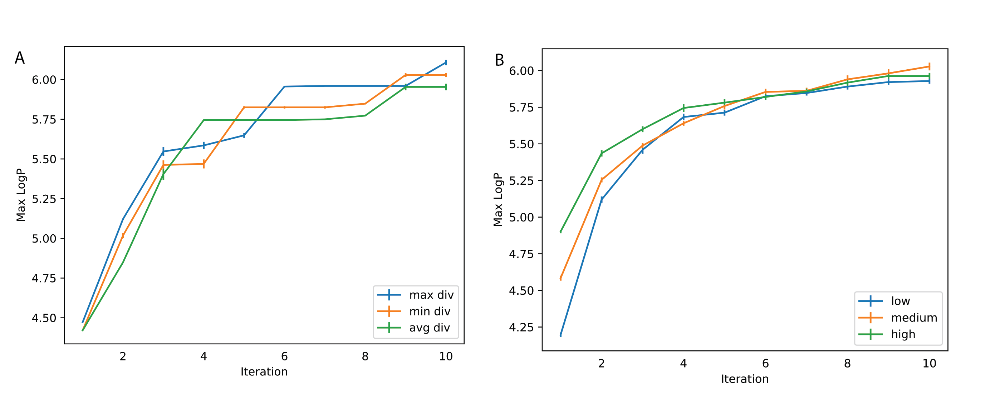

<small><b>Figure 2:</b> **(A)**: Applying BBRT-Seq2Seq to three seed sequence sets with 100 samples each. The MaxMin algorithm was used to select samples with varying levels of diversity (max: 0.94, avg: 0.96, and min: 0.78). For each input sequence, we sampled 100 times from a top-5 sampler and ranked samples using logP. Standard error is reported by averaging over 10 BBRT-Seq2Seq runs with different seed sets. **(B)**: Applying BBRT-Seq2Seq to three seed sequence sets with 100 samples each and varying logP values (low: logP values < 1, medium: [-1 1], high: values > 1). Standard error is reported by averaging over 10 runs each with a randomly chosen set of seed sequences.</small>

For both BBRT applications, we sampled 100 complete sequences from a top-$2$ and from a top-$5$ sampler and then aggregated these outputs with a beam search using 20 beams outputting 20 sequences.

**Baselines.** We compare our method with the following state-of-the-art
baselines. Junction Tree VAE (JT-VAE)[@Jin2018vae] combines a
graph-based representation with latent variables for molecular graph
generation. Molecular optimization is performed using Bayesian
Optimization on the learned latent space to search for compounds with
optimized property scores. JT-VAE has been shown to outperform other
methods including CharacterVAE[@GomezBombarelli2018dh], GrammarVAE[@Kusner2017tv], and Syntax-Directed-VAE[@dai2018syntaxdirected]. We also compare against two reinforcement learning molecular generation
methods: Objective-Reinforced Generative Adversarial Networks (ORGAN)[@Guimaraes2017uy] uses SMILES strings [@weininger1988smiles], a text-based molecular representation, and the Graph Convolutional Policy
Network (GCPN)[@You2018wca], uses graphs.

We also compare against non-recursive variants of the Seq2Seq and
Variational Junction-Tree Encoder-Decoder (JTNN)[@jin2018g2g] models.
Seq2Seq is trained on the SELFIES representation[@Krenn2019tk]. For a
fair comparison, we admit similar computational budgets to these
baselines. For Seq2Seq we include a deterministic and stochastic
decoding baseline. For the deterministic baseline, we use beam search
with 20 beams and compute the 20 most probable sequences under the
model. For the stochastic baseline, we sample 6600 times from a top-5
sampler. For details on the sampler, we refer readers to the ['Current inference methods'](#current-inference-methods) section. For JTNN, we
use the reported [GitHub implementation](https://github.com/wengong-jin/iclr19-graph2graph) from Jin et al. (2019)[@jin2018g2g]. There is not an
obvious stochastic and deterministic parallel considering their method
is probabilistic. Therefore, we focus on comparing to a fair
computational budget by sampling 6600 times from the prior distribution
followed by greedy decoding. For fair comparisons to the recursive
application, the same corresponding sampling strategies are used, with
100 samples per iteration.

**Results.** Following reporting practices in the literature, we report
the top 3 property scores found by each model. **Table 1** summarizes these
results:

|                        |                  | **Penalized logP** |                 |         | **QED** |         |
| :--------------------- | :--------------: | :-------------------------------------------------: | :-------------: | :-----: | :--------------------------------------: | :-----: |
| **Method**             |     **1st**      |                       **2nd**                       |     **3rd**     | **1st** |                 **2nd**                  | **3rd** |
| <mark>ZINC-250K</mark> |      4\.52       |                        4\.30                        |      4\.23      | 0\.948  |                  0\.948                  | 0\.948  |
| ORGAN                  |      3\.63       |                        3\.49                        |      3\.44      | 0\.896  |                  0\.824                  | 0\.820  |
| JT-VAE                 |      5\.30       |                        4\.93                        |      4\.49      | 0\.925  |                  0\.911                  | 0\.910  |
| GCPN                   |      7\.98       |                        7\.85                        |      7\.80      | 0\.948  |                  0\.947                  | 0\.946  |
| JTNN                   |      5\.97       |                        4\.96                        |      4\.71      | 0\.948  |                  0\.948                  | 0\.948  |
| Seq2Seq                |      4\.65       |                        4\.53                        |      4\.49      | 0\.948  |                  0\.948                  | 0\.948  |
| BBRT-JTNN              | <mark>**10\.13** |                  <mark>**10\.10**                   | <mark>**9\.91** | 0\.948  |                  0\.948                  | 0\.948  |
| BBRT-Seq2Seq           |      6\.74       |                        6\.47                        |      6\.42      | 0\.948  |                  0\.948                  | 0\.948  |

<small><b>Table 1:</b> Top 3 property scores on penalized logP and QED tasks</small>

 The top 3 property scores found in ZINC-250k are included for
comparison. For logP optimization, BBRT-JTNN significantly outperforms
all baseline models including JTNN, Seq2Seq, and BBRT-Seq2Seq.
BBRT-Seq2Seq outperforms Seq2Seq, highlighting the benefits of recursive
inference for both molecular representations. For QED property
optimization, the two translation models and the BBRT variants all find
the same top 3 property scores, which is a new state-of-the-art result
for QED optimization.

In **Figure 3** (below), we report the top 100 logP compounds
generated by both BBRT applications relative to its non-recursive
counterparts and observe significant improvements in logP from using
BBRT. We also report a diversity measure of the generated candidates for
both BBRT models and the top 100 logP compounds in the training data.
The JTNN variant produces logP compounds that are more diverse than the
compounds in the training data, while the compounds generated by Seq2Seq
are less diverse:

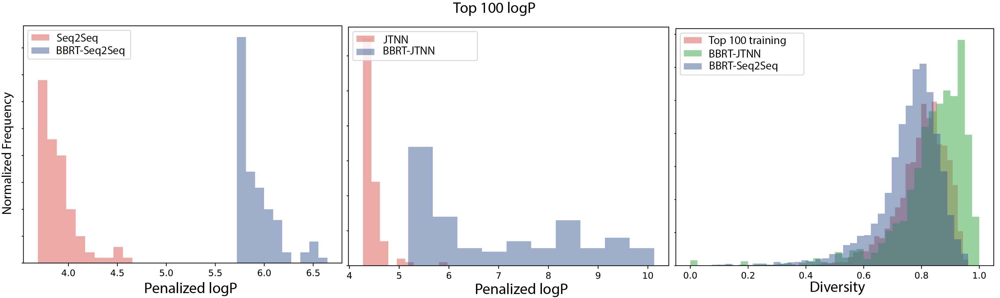

<small><b>Figure 3:</b> **(Left and Center)**: Top 100 logP generated compounds under BBRT-Seq2Seq, BBRT-JTNN, and their non-recursive counterparts. **(Right)**: Diversity of top 100 generated compounds under both BBRT models and the top 100 compounds from the training data.</small>

**Figure 4** visualizes the top 2 discovered compounds by
BBRT-JTNN and BBRT-Seq2Seq under both properties:

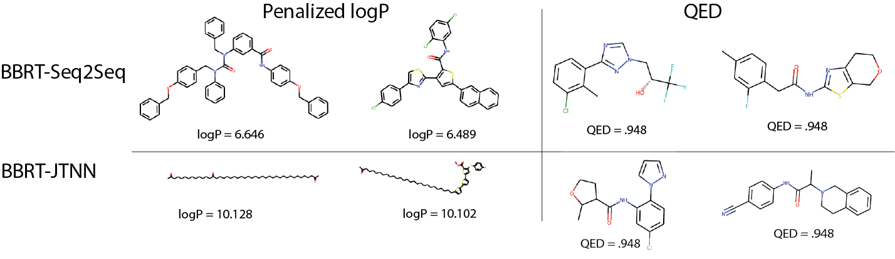

<small><b>Figure 4:</b> Top scoring compounds for properties logP and QED under BBRT-Seq2Seq
and BBRT-JTNN</small>

 For logP, while BBRT-JTNN produces compounds with higher property values, BBRT-Seq2Seq’s
top 2 generated compounds have a richer molecular vocabulary.
BBRT-Seq2Seq generates compounds with heterocycles and linkages while
BBRT-JTNN generates a chain of linear hydrocarbons, which resemble the
top reported compounds in GCPN[@you2018graphrnn], an alternative
graph-based representation. The stark differences in the vocabulary from
the top scoring compounds generated by the sequence- and graph-based
representations highlight the importance of using flexible frameworks
that can ensemble results across molecular representations.

**Differences between logP and QED.** For logP, BBRT provides a 27%
improvement over state-of-the-art for property optimization, while for
QED, despite recursive methods outperforming ORGAN, JT-VAE and GCPN, the
corresponding non-recursive techniques -- Seq2Seq and JTNN baselines --
perform just as well as with and without BBRT. We argue this might be a
result of these models reaching an upper bound for QED values,
motivating the importance of the community moving to new metrics in the
future[@Korovina2019vi].

### Empirical properties of recursive translation

We perform a sequence of ablation experiments to better understand the
effect of various BBRT design choices on performance. We highlight the
variability in average logP from translated outputs at each iteration
with different decoding strategies (**Figure 5A. Left.**)
and scoring functions (**Figure 5A. Right.**):

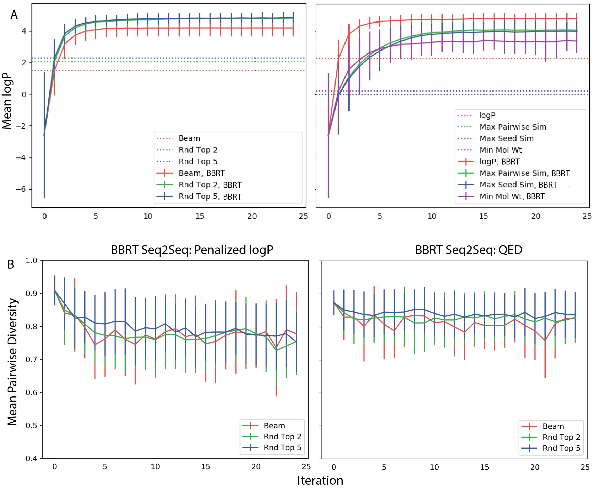

<small><b>Figure 5:</b> Ablation experiments using BBRT-Seq2Seq. **(A. Left):** Mean LogP from 900 translations as a function of recursive iteration for three decoding strategies. Dotted lines denote non-recursive counterparts. **(A. Right):** Mean logP as a function of recursive iteration for 4 scoring functions. **(B. Left):** Diversity of generated outputs across recursive iterations for logP translation. **(B. Right):** Diversity of generated outputs across recursive iterations for QED translation. </small>

**On the importance of stochastic decoding.** For non-recursive and
recursive translation models, **stochastic decoding methods outperformed
deterministic methods** on average logP scores (**Figure 5A. Left**) average pairwise diversity (**Figure 5B.**) for generated compounds as a function of
recursive iteration. Non-greedy search strategies are not common
practice in *de novo* molecular design[@GomezBombarelli2018dh] [@Kusner2017tv] [@jin2018g2g]. While recent
work emphasizes novel network architectures and generating diverse
compounds using latent variables[@GomezBombarelli2018dh] [@Kusner2017tv] [@Jin2018vae], we identify an
important design choice that typically has been underemphasized. This
trend has also been observed in the natural language processing (NLP)
literature where researchers have recently highlighted the importance of
well-informed search techniques[@Kulikov2018tv].

Regardless of the decoding strategy, we observed improvements in mean
logP with iterations (**Figure 5A**) when using BBRT.
When optimizing for logP, a logP scoring function quickly discovers the
best scoring compounds while secondary scoring functions improve logP at
a slower rate and do not converge to the same scores (**Figure 5A. Right**). This trade-off highlights the role of conflicting molecular design objectives.

For **Figure 5A**, the standard deviation typically
decreased with iteration number $n$. Property values concentrate to a
certain range. With property values concentrating, it is reasonable to
question whether BBRT produces compounds with less diversity. In Figure
**Figure 5B** we show average pairwise diversity of translated
outputs per recursive iteration across 3 decoding strategies and observe
decay in diversity for logP. For the best performing decoding strategy,
the top-$5$ sampler, diversity decays from about 0.86 after a single
translation to about 0.78 after $n=25$ recursive translations. This
decay may be a product of the data -- higher logP values tend to be less
diverse than a random set of compounds. For QED (**Figure 5B. Right**), we observe limited decay. Differences indecay rate might be attributed to task variability: one being explorative and the other interpolative.

### Interpretable, user-centric optimization

For project teams in drug design, the number of generated suggestions
can be a practical challenge to prioritization of experiments. We found
that interpretable paths of optimization facilitate user adoption.

**Molecular traces.** BBRT generates a sequence of iterative, local
edits from an initial compound to an optimized one. We call these
optimization paths a **molecular trace**:

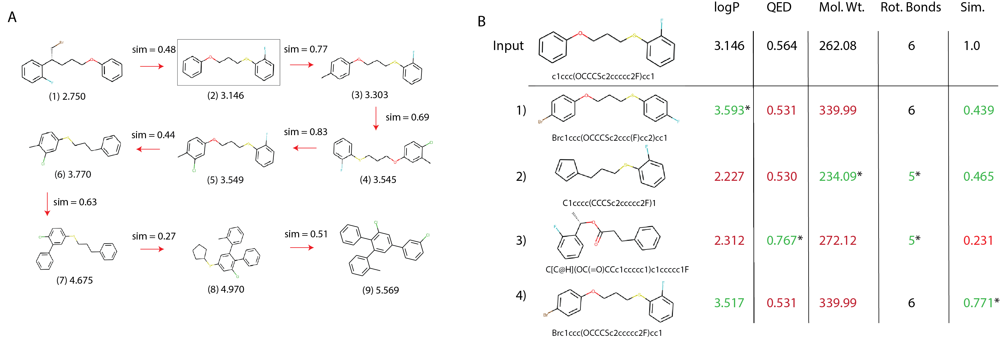

<small><b>Figure 6:</b> **(A)**: Generated molecular trace by ranking intermediate outputs by the maximum pairwise Tanimoto similarity. **(B)**: An example of a molecular breakpoint. Alternative translations are considered from compound (2) each with its own design trade-offs.</small>

We use the Min Delta Sim scoring function to generate traces that have the
minimum possible structural changes, while still improving logP. While
some graph-based approaches[@Jin2018vae] [@you2018graphrnn] [@Kearnes2019tbb] can return valid,
intermediate graph states that are capable of being interrogated, we
liken our molecular traces to a sequence of Free-Wilson analysis[@FREE1964kq] steps towards optimal molecules. Each step represents a local model built using molecular subgraphs with the biological activity
of molecules being described by linear summations of activity contributions of specific subgraphs. Consequently, this approach provides interpretability within the chemical space spanned by the subgraphs[@Eriksson2014].

**Molecular breakpoints.** Molecular design requires choosing between
conflicting objectives. For example, while increased logP is correlated
with poor oral drug-like properties and rapid clearance from the body[@Ryckmans2009], increasing QED might translate to a compound that is structurally dissimilar from the seed compound, which could result in an
inactive compound against a target. Our method allows users to
"debug" any step of the translation process and consider alternative
steps, similar to breakpoints in computer programs. In **Figure 6B**, we show an example from an BBRT-Seq2Seq model trained to optimize logP. Here, we revisit the translation from step (2)
to step (3) in **Figure 6A** by considering four alternatives picked from 100 stochastically decoded compounds. These alternatives require evaluating the trade-offs between logP, QED,
molecular weight, the number of rotational bonds, and chemical
similarity with compound (2).

### Improving secondary properties by ranking

We consider secondary property optimization by ranking recursive outputs
using a scoring function. This function decides what compound is
propagated to the next recursive step. We apply BBRT to Seq2Seq modeling
(BBRT-Seq2Seq) and use the trained QED translator described in [Section 5.1](#molecule-generation-results). The inference task is to optimize QED and logP as the primary and secondary
properties respectively. We compare scoring outputs based on QED and
logP:

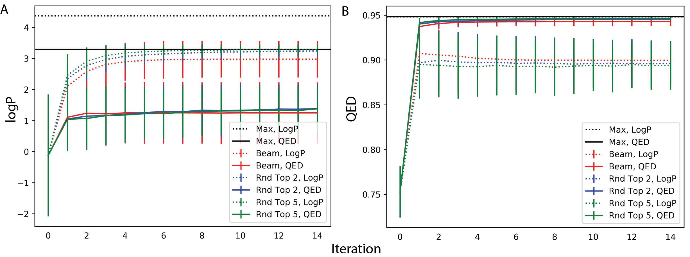

<small><b>Figure 7:</b> Applying BBRT to multi-property optimization. QED is the primary target and logP is the secondary property. **(A)**: Average logP as a function of recursive iteration for three decoding strategies with primary and secondary property scoring functions. **(B)**: Average QED as a function of recursive iteration for three decoding strategies with primary and secondary property scoring functions.</small>

In **Figure 7A**, we compute the average logP per
recursive iteration for a set of translated compounds across three
decoding strategies. Dotted lines optimize logP as the scoring function
while the solid lines optimize QED. For both scoring functions, we
report the maximum logP value generated. For all decoding strategies,
average logP reaches higher values under scoring by logP relative to
scoring by QED. In **Figure 7B**, we plot average QED values
using the same setup and observe that optimizing logP still
significantly improves the QED values of generated compounds. This
method also discovers the same maximum QED value as scoring by QED. This
improvement, however, has trade-offs in the limit for average QED values
generated. After $n=15$ recursive iterations the *average* QED values of
the generated compounds under a logP scoring function converge to lower
values relative to QED values for compounds scored by QED for all three
decoding strategies. We repeat this experiment with JTNN and show
similar effects:

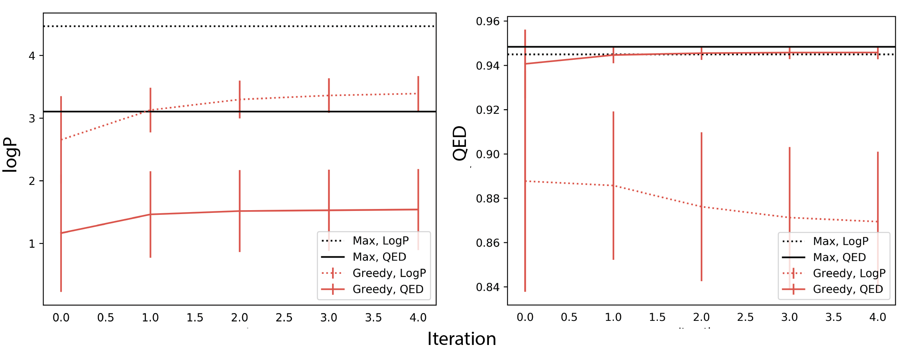

<small><b>Figure 8:</b> Applying BBRT-JTNN to secondary property optimization. QED is the primary target and logP is the secondary property. **(Left)**: Average logP as a function of recursive iteration under two scoring functions---QED and logP. **(Right)**: Average QED as a function of recursive iteration for same two scoring functions.</small>

Secondary property optimization by ranking extends to variables that are
at minimum loosely positively correlated. For QED optimization, the
average logP value for unoptimized QED compounds is $0.30 \pm{1.96}$
while for optimized QED compounds the average logP value is
$0.79 \pm{1.45}$. Additionally, QED compounds in the target range [0.9
1.0] in the training data had a positive correlation between its logP
and QED values (Spearman rank correlation; $\rho=0.07$ $P < 0.026$).
This correlation did not hold for QED compounds in the range [0.7 0.8]
unoptimized QED compounds ($\rho=0.007$, $P<0.8$).

## Future work

We develop BBRT for molecular optimization. BBRT is a simple algorithm
that feeds the output of translation models back into the same model for
additional optimization. We apply BBRT to well-known models in the
literature and produce new state-of-the-art results for property
optimization tasks. We describe molecular traces and user-centric
optimization with molecular breakpoints. Finally, we show how BBRT can
be used for multi-property optimization. For future work, we will extend
BBRT to consider multiple translation paths simultaneously. Moreover, as
BBRT is limited by the construction of labeled training pairs, we plan
to extend translation models to low-resource settings, where property
annotations are expensive to collect.

## Appendix

### A. Recursive penalized logP experiments

**Training details**. For the Seq2Seq model, the hidden state dimension
is 500. We use a 2 layer bidirectional RNN encoder and 1 layer
unidirectional decoder with attention[@Bahdanau2016te]. The model was
trained using an Adam optimizer for 20 epochs with learning rate 0.001.
For the graph-based model, we used the implementation from Jin et al. (2019)[@jin2018g2g],
which can be downloaded from <https://github.com/wengong-jin/iclr19-graph2graph>.

**Property calculation**. Penalized logP is calculated using the
implementation from You et al. (2018)[@You2018wca]. [Their implementation](https://github.com/bowenliu16/rl_graph_generation) utilizes RDKit to
compute clogP and synthetic accessibility scores. QED scores are also
computed using RDKit.

### B. Supplemental Experiments

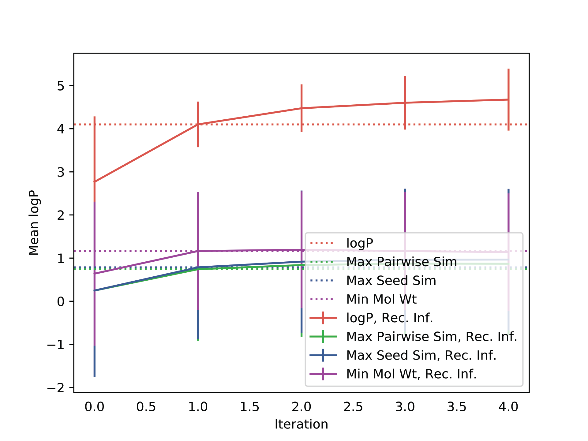

<small><b>Figure 9:</b> Comparison of scoring functions for BBRT-JTNN. Y-axis is mean logP
from 900 translations as a function of recursive iteration. Dotted lines denote non-recursive counterparts. "Rec. Inf." is synonymous with BBRT-JTNN.</small>

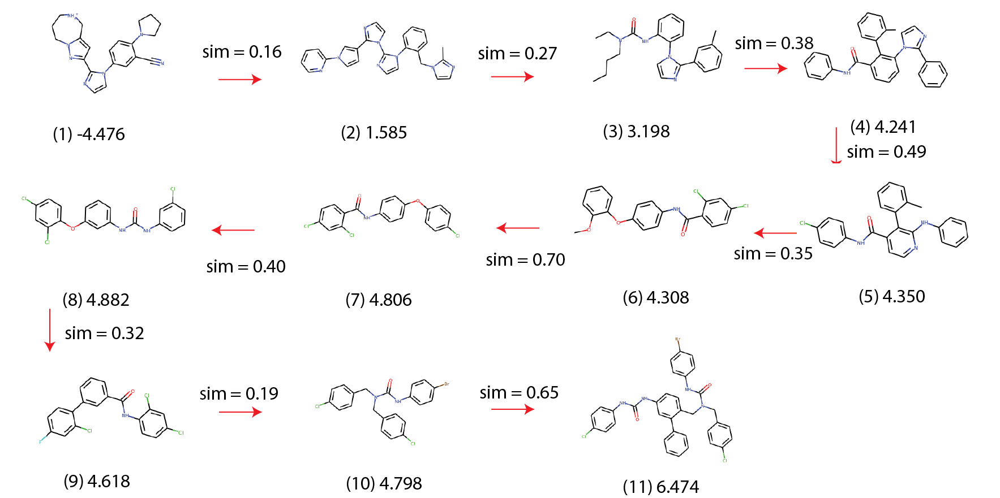

<small><b>Figure 10:</b> A molecular trace from optimizing logP using a logP scoring function.</small>

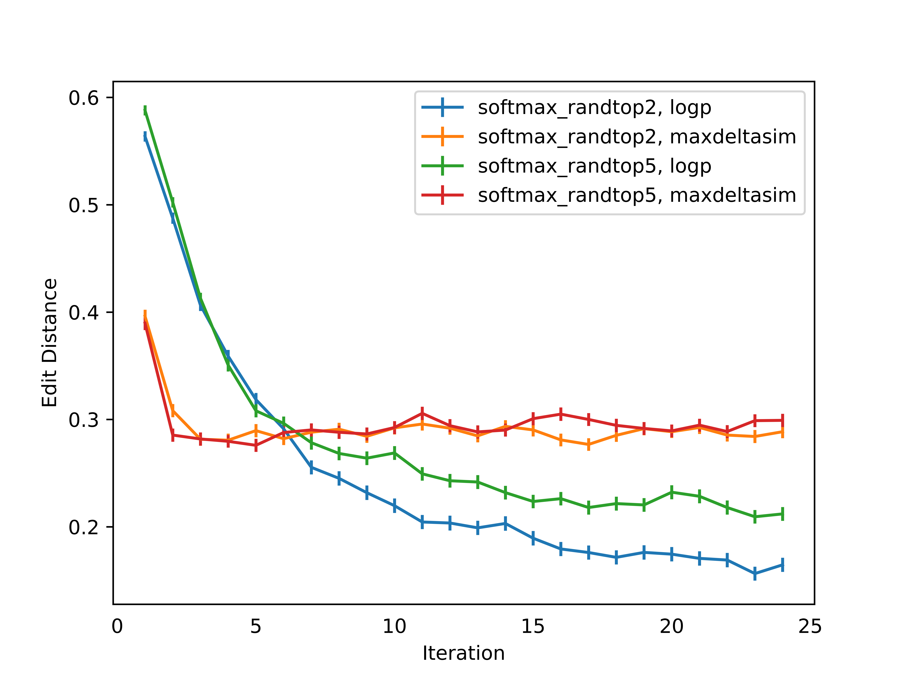

<small><b>Figure 11:</b> Comparing pairwise Levenshtein edit distances for generated sequences
after running BBRT under two different scoring functions (logP and
maximum pairwise Tanimoto similarity) and two different decoding
strategies (top-2 and top-5 sampling). Standard errors are reported from
a population of 900 sequences per iteration..</small>

\bibliography

<!-- ----

<object data="../img/bbrt_iclr2020.pdf" type="application/pdf" width="750px" height="800px">
    <embed src="../img/bbrt_iclr2020.pdf">
    </embed>
</object> -->