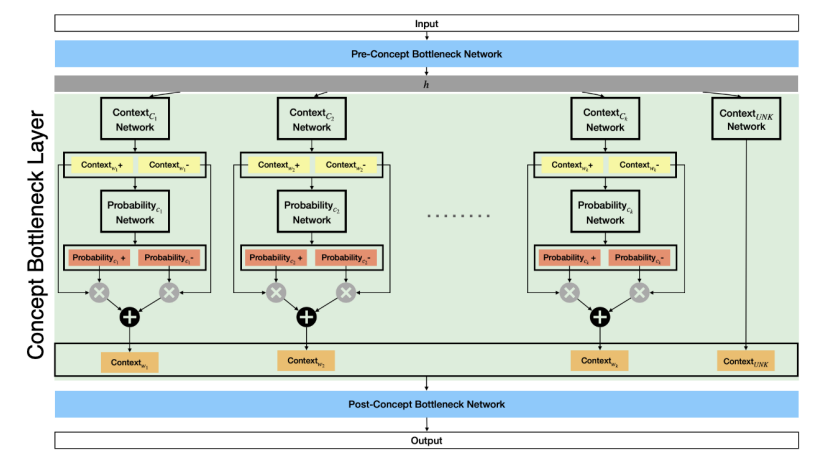

---
hide:
  - navigation
---

#

## Bio

I am the Director of Frontier Research and part of the Founding Team of [Prescient Design](https://www.gene.com/prescient), a machine learning startup that was acquired by Genentech in 2021 and has now been integrated as a dedicated AI/ML research group within Genentech Computational Sciences (gCS). My research focuses on statistical machine learning for scientific discovery with applications to biomedicine and drug discovery. Previously, I was Head of Machine Learning of Pfizer R&D, where I led a group focused on developing new ML algorithms for problems across the drug discovery and development pipeline. My background is in statistical machine learning and neuroscience, having worked on my Ph.D. in Computer Science and Statistics. I finished my graduate studies at Columbia University and undergraduate studies at Cornell University.  

 

----

## Recent Papers

[**<ins>Protein discovery with discrete walk-jump sampling</ins>**](https://arxiv.org/abs/2306.12360)  
Nathan C. Frey, Daniel Berenberg, Karina Zadorozhny, Joseph Kleinhenz, Julien Lafrance-Vanasse, Isidro Hötzel, Yan Wu, **Stephen Ra**, Richard  Bonneau, Kyunghyun Cho, Andreas Loukas, Vladimir Gligorijević, Saeed Saremi  
*ICLR 2024 (Oral)*  
[Paper](https://arxiv.org/abs/2306.12360) | [Code](https://github.com/Genentech/walk-jump)  

 

[**<ins>Concept bottleneck generative models</ins>**](https://openreview.net/pdf?id=zFOdOChRPR)  
Aya Abdelsalam Ismail, Julius Adebayo, Héctor Corrada Bravo, **Stephen Ra**, Kyunghyun Cho  
*ICLR 2024*  
[Paper](https://openreview.net/pdf?id=zFOdOChRPR)  

 

[**<ins>3D molecule generation by denoising voxel grids</ins>**](https://arxiv.org/abs/2306.07473)  
Pedro O. Pinheiro, Joshua Rackers, Joseph Kleinhenz, Michael Maser, Omar Mahmood, Andrew Martin Watkins, **Stephen Ra**, Vishnu Sresht, Saeed Saremi  
*NeurIPS 2023*  
[Paper](https://arxiv.org/abs/2306.07473)  
